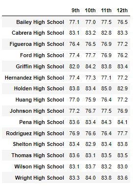
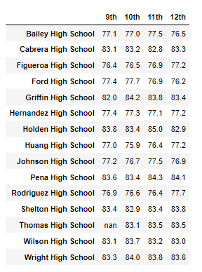

# School District Analysis

## Project Overview

Analysis on school district performance, provide insights and visualize the results; using Pandas library, Numpy library, and Jupyter Notebook with Python. 

In this project we will work with Maria, the chief data scientist for a city school district, to provide the initial analysis based on data collected from many schools and students across the school district.
The School Board would like to understand various performance metrics at the district and school level. This analysis will assist the school board and superintendent in making decisions regarding the school budgets and priorities.

## Purpose

While the School Board is pleased with the insights that we have provided, it has been identified that there is some anomalies in the data, in particular in the math and reading scores of the grade 9 students at Thomas High School. 
In order to ensure these results do not skew the analysis, the entire scores of ninth grade class of Thomas High School replaced with NaN. We will now review how this change impacted various parts of the first analysis.

### Resources
:card_file_box: Schools Data : [schools_complete.csv](/Resources/schools_complete.csv) 
:card_file_box: Students Data : [students_complete.csv](/Resources/students_complete.csv) 
:card_file_box: Anaconda Software : [64-Bit Graphical Installer](https://www.anaconda.com/products/distribution) 

 

## Analysis Results 
    
### Impact on District Analysis

 ***District Summary - Original***
 
   
 ***District Summary - Updated***
  
  
The change of adding NaN value to all grade 9 of Thomas High School math and reading scores, did not have a large impact on the district summary analysis. It's important to consider there are only 461 students in grade 9 at Thomas High School, and the total student count is 39,170, which is 1.2% of the total student, so removing their math and reading scores can only impact the averages.  
 

### Impact on school summary

***Top Schools - Original***

  
***Top Schools - Updated***

- The ranking of the top schools including Thomas High School, was not affected by the update.
- While the average math, reading and overall scores at Thomas High School were impacted with the update, the changes were not enough to change its relative ranking in compare with other schools.

***Bottom Schools - Original***

***Bottom Schools - Updated***

 
The ranking of the bottom schools was not affected after adding NaN value to all grade 9 of Thomas High School math and reading scores.
 
 

### Impact on Math and Reading Scores by Grade

***Math Scores***

<table>
  <tr>
    <th>- Original -</th>
    <th>- Updated -</th>
  </tr>
  <tr>
    <td></td>
    <td></td>
  </tr>
</table>

 

***Reading Scores***

<table>
  <tr>
    <th>- Original -</th>
    <th>- Updated -</th>
  </tr>
  <tr>
    <td></td>
    <td></td>
  </tr>
</table>
 

The only score that was impacted on this DataFrame was the grade 9 students at Thomas High School that have NaN instead of a grade for both math and reading.
 
 

### Impact on Scores by School Spending

***Original***

***Updated***

 

There was a slight change in this score for the $630-644 group, where Thomas High School is grouped, however the change is small with each metric changing.
 
 

### Effects on Scores by School Size

***Original***

 

***Updated***

 
The scores for the Medium size schools changed slightly which Thomas High School included in this group as it has 1,635 students who attend, including the grade 9 students.

### Impact on Scores by School Type

***Original***

***Updated***

 
Thomas High School is a Charter type school, so this is why we see changes to the scores for Charter, but no changes to District type school scores and no other school scores were affected.

## Summary
The updated school district analysis after reading and math scores for the ninth grade at Thomas High School have been replaced with NaNs:

- District Analysis : The district as a whole has also had its average math and reading scores decrease, as well as the passing percentages for students.
- Top School Ranking : No change to ranking, however Thomas High School scores did change in the passing rate and average grades.
- Scores by School Size : Changes to Medium (1000-2000) grouping for all scores by less than 0.1 percentage points.
- Scores by School Type : chages to Charter type group for all scores by less than 0.1 percentage points.
 

 
